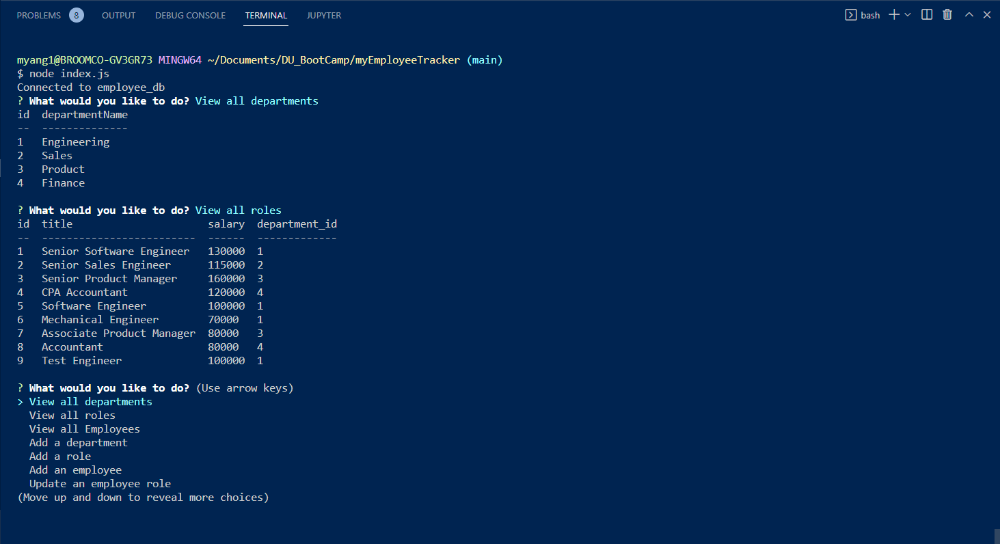

# myEmploy
  ## myEmployeeTracker
  ___
  ## Table on Contents

  1. [License](#License)
  2. [Description](#Description)
  3. [Installation](#Installation)
  4. [Usage](#Usage)
  5. [Contributing](#Contributing)
  6. [Tests](#Tests)
  7. [Questions](#Questions)
  ___
  ## License
  
  ___
  ## Description
  This application uses node.js, the inquirer module, the mysql2 module and the console.table module to create a employee tracker application. The inquirer cli will prompt the user a series of questions to create, update, and view employee information that is stored in a mysql database. The console.table module prints the mysql table nicely to the console. 
  ___
  ## Installation
  To install the project clone the repository and run npm install.
  ___
  ## Usage
  To use the application, navigate to the root directory run node index.js and follow inquirer cli prompts.

  

  Link to usage example here: [VIDEO](https://drive.google.com/file/d/1buKSWFK6h33Vvby3BiXHFJwvYebi3UgE/view)
  ___
  ## Contributing
  Contribution to this project are welcome. Clone repository and customize to your liking.
  ___
  ## Tests
  There are not test for this application at this moment. To test the application run application and create and employee database.
  ___
  ## Questions
  For more information and questions please email me @ matthew.yang@hunterdouglas.com 

  [GitHub: myang53tr](https://github.com/myang5t3r)
  ___
  